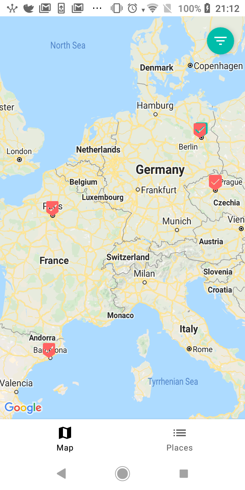
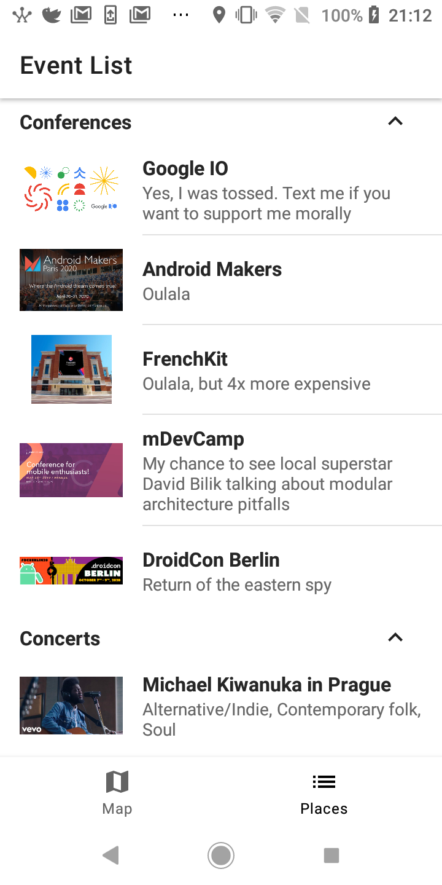
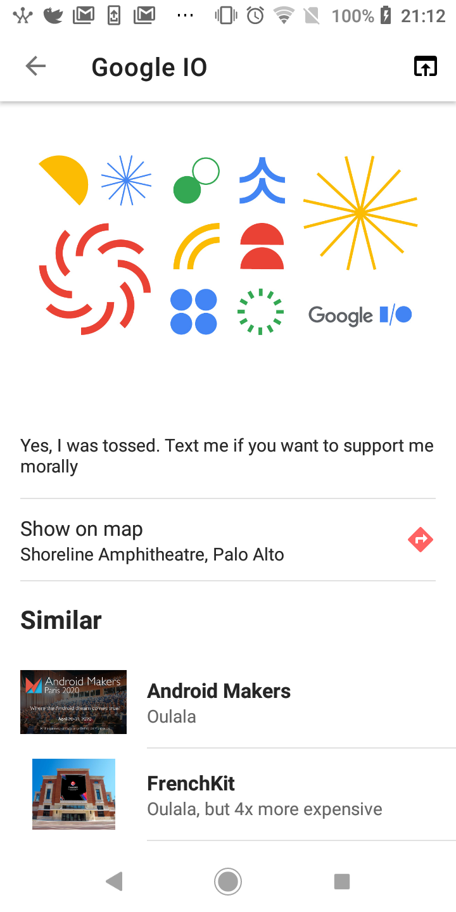

# Events 2020

## Project
Believe or not, 2020 supposed to be quite an interesting year for me in terms of traveling.
This is a project with 2020 Events that I have missed/will miss due to caramba virus 🦠.
Here I show my approach to navigation in multi-module Android app.

## Screenshots

| Map | List |  Detail |
| --- | ---- | ------- |
| |   |  |

## Git
Wondering what all these emojis are? Checkout [gitmoji](https://gitmoji.carloscuesta.me/).

## Tech stack

* Kotlin corutines & Flow
* Koin
* [Epoxy](https://github.com/airbnb/epoxy)
* [FlowBinding](https://github.com/ReactiveCircus/FlowBinding)
* [FlowPreferences](https://github.com/tfcporciuncula/flow-preferences)
* Architecture components
* Timber

## Structure

3 layers:
* App - container for the whole app, contains DI graph, basic setup of global stuff (Timber, etc.)
* Features - contain single feature, features should be independent and can depend on libraries.
* Libraries - contain shared code, can depend on each other.

Features:
- **:events**
Contains event list/detail flow.
- **:map**
Module with map presentation of events and places.

Libraries:
- **:domain**
Module with application domain.
- **:navigation**
Module responsible for app navigation.
- **:ui**
Presentation related code which can be shared between features.

## Briefly about navigation
[Jetpack](https://developer.android.com/jetpack) Navigation Component is used for in-app navigation.
Due to limitations of Navigation Component in context of modular architecture, global **:navigation** module was introduced to handle navigation between features.
Navigation implementation is highly inspired by FlowCoordinator pattern mostly used in iOS apps.
This allows to delegate navigation logic as well as supply different presentation contexts for same screen.
Internally, navigation is composed of **flow**s. Each flow maps to framework Activity.
Navigation within single flow (Activity) is done via Navigation Component.
navigation between flows is done the good old way by firing Activity intents.